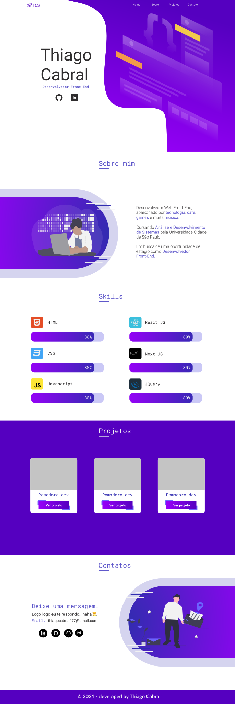

  

<h1 align="center">
    
</h1>

<h4 align="center">
	Deploy: <a href="https://thiagocabral.vercel.app/">https://thiagocabral.vercel.app/</a>
</h4>

 <a href="#-sobre-o-projeto">Sobre</a> •
 <a href="#-layout">Layout</a> •
 <a href="#-tecnologias">Tecnologias</a> •
 <a href="#-autor">Autor</a> •
 <a href="#user-content--licença">Licença</a>

## 💻 Sobre o projeto

Criei esse portfólio para mostrar meus projetos e as tecnologias que venho estudando atualmente.

---

## 🎨 Layout

  

## 🛠 Tecnologias

As seguintes ferramentas foram usadas na construção do projeto:

- **[Typescript](https://pt-br.reactjs.org/)**
- **[ReactJS](https://pt-br.reactjs.org/)**
- **[NextJS](https://nextjs.org/)**
- **[Axios](https://github.com/axios/axios)**
- **[React-icons](https://fontawesome.com/how-to-use/on-the-web/using-with/react)**
- **[React-scroll](https://github.com/fisshy/react-scroll)**

#### **Utilitários**

- Design: **[Figma](https://www.figma.com/)**
- Editor: **[Visual Studio Code](https://code.visualstudio.com/)**
- Fontes: **[Roboto](https://fonts.google.com/specimen/Roboto)**, **[Roboto Mono](https://fonts.google.com/specimen/Roboto+Mono?query=roboto+mon)**

---

## 👨🏽‍💻 Autor

 
  
 <b>Thiago Cabral</b></a>
  

---

## 📝 Licença

[Licença](./LICENSE)

Feito com ❤️ por Thiago Cabral 🚀
